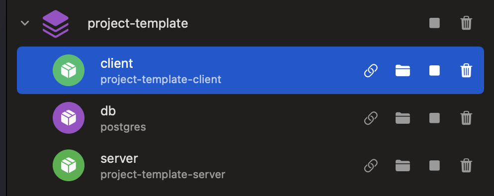
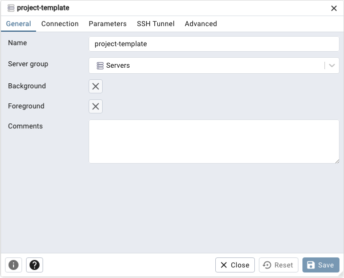
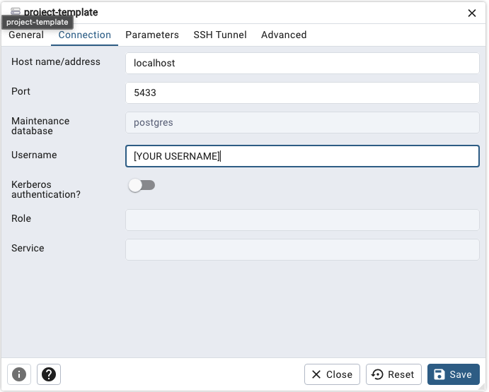

This repository is intended to get a web-application to a solid starting point, and is built using: React, Node, Express, & Postgresql. It is intended to be developed, shipped, and run using Docker. 

This project template containerizes your client (React), server (Node/Express), and database (Postgres) in Docker by utilizing a `docker-compose.yml` script and the official Docker images for these technologies, when applicable.

Below are step-by-step instructions on getting this set up:

# Prerequisites

## Download Docker

Make sure [Docker Desktop](https://www.docker.com/products/docker-desktop/) is installed on your computer. You can check this by running `docker ps` in your terminal. If it returns columns like `CONTAINER ID`, `IMAGE`, etc., then you're in business!

## Download pgadmin4

pgadmin4 is the recommended user interface for evaluating the project's database. More instructions on how to configure your
project's database with this application will follow. If you have home brew installed on your computer, you can simply execute this command:
```
brew install pgadmin4
```

## Initialize `npm`

1. Navigate to your `/client` directory and execute the following command:
```
npm init
```
2. Navigate to your `/server` directory and execute the same command as above.

# Project setup

**🚨 Important:** Reference the `.example-env` file as an example for setting up your `.env` file locally.

Create a `.env` file locally in the root directory of your project. See the `.example-env` file for the values you'll need to update, as these will be reference in `docker-compose.yml`.

## Setting up your client

Set `CLIENT_PORT` equal to `3000` in your `.env` file. This is the default, predetermined port prescribed by NextJs to run the React server.

You can test this connection by navigating into the `/client` directory and running `npm run dev`. Open [http://localhost:3000](http://localhost:3000) with your browser to see the result. When everything is setup, you won't need to run this command, as Docker will take care of firing up the entire project, which will be covered later on.

## Setting up your server

### Node

Set `SERVER_PORT` equal to your desired port. Be sure to check that the value you choose isn't being used by an already-open or already-existing port. Similar to setting up our client, you can test this connection by navigating into the `/server` directory and running `npm run dev`. You should see a log in your terminal that says "Server is listening at http://localhost:[YOUR PORT NUMBER]".

### Postgres

Configure your `.env` to match what's in `.example-env` file under the `#Database` comment. Note that all values should be updated *except* for `DB_PORT`, as this is the default port used by Postgres.

# Firing up your application using `docker-compose.yml`

**🚨 Important:** Make sure what you have declared as variables in your `.env` file match the names declared in your `docker-compose.yml` and `Dockerfile` files. The terminal logs should clearly outline this as an issue, if variables do not match when firing up the application.

Now that your client, server, and database have their own respective containers in Docker, you can run the command below to spin everything up (or tear everything down) at once:

To spin up Postgres and NodeJS together:
```
docker compose up
```

To tear it all down:
```
docker compose down
```

**🚨 Important: rebuilding containers**

Whenever you make changes to the files in your the `/server` or `/client` directory of your project and want to see those changes reflected in your container, you need to run:

TODO: Make nodemon do this work instead

```
docker compose build
```

And that's it! You should now be set up to successfully fire up the back-end portion of your project.

At this point in the project, you should see your project's containers up and running in your Docker interface:

(Shown in Orbstack)

## Setting up pgadmin4

Once everything within the project directory is configured, you can now interact with your database through pgadmin4's application interface as the Docker container was running. Reference the screenshot below for values you'll have to update to add your database and interact with it:

1. Register server:



3. Click save.

4. Navigate to "Connection" tab.

2. Add your server credentials:



Click save.

# Setup troubleshooting
See [TROUBLESHOOTING.md](TROUBLESHOOTING.md) for helpful tips on addressing errors you may run into while setting up your project.

# Behind the scenes
See [LEARNING.md](LEARNING.md) to learn more about what's going on behind the scenes for `docker-compose.yml` to be the only command required for firing up the project.